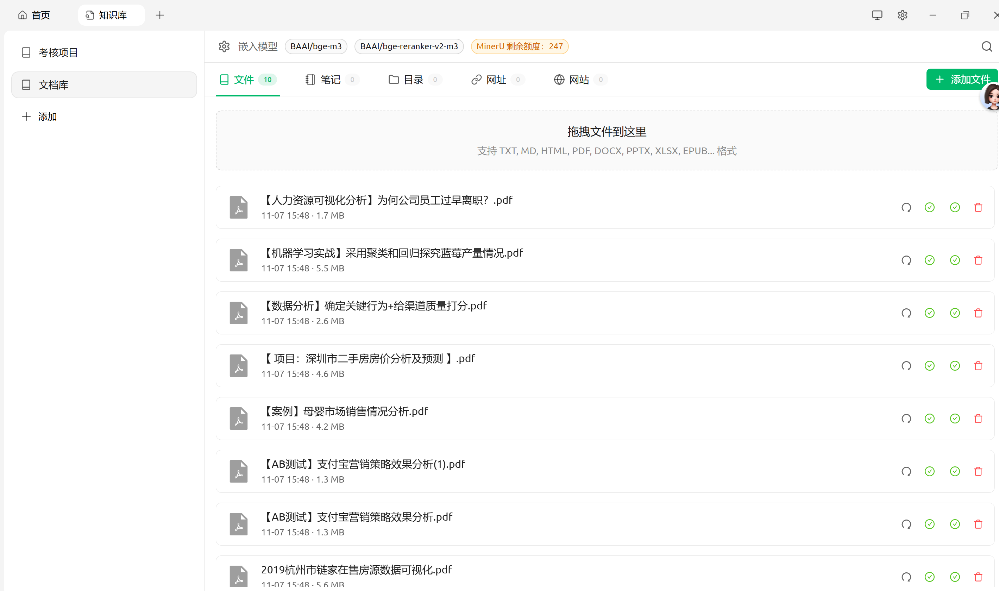
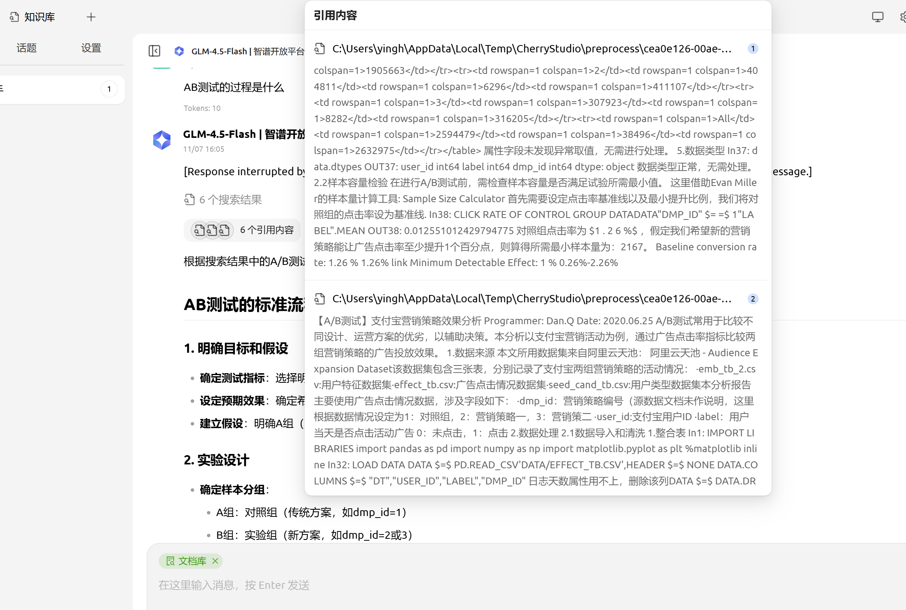
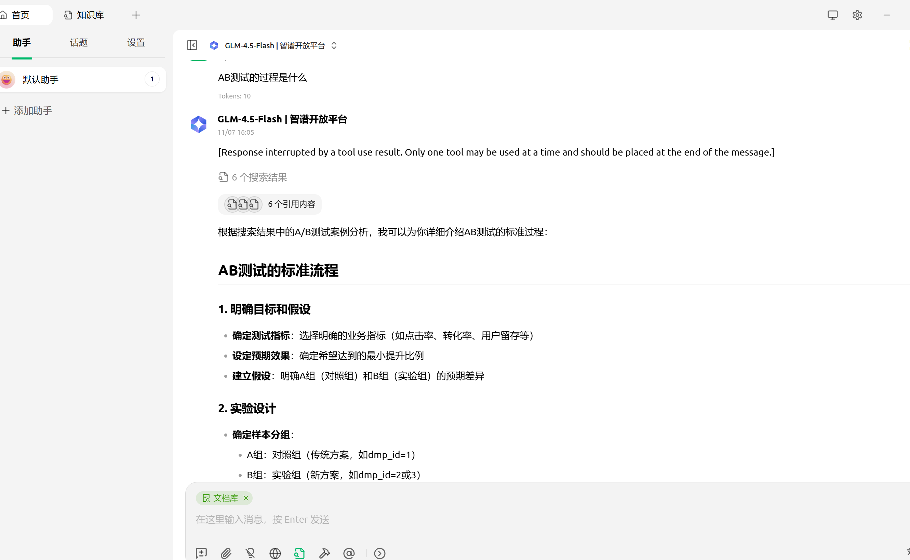

# 智能问答系统 - RAG知识库
# Smart Q&A System - RAG Knowledge Base

## 项目简介 / Project Introduction

基于Flask + ChromaDB + Ollama的本地知识库问答系统，实现检索增强生成（RAG）功能。

A local knowledge base Q&A system based on Flask + ChromaDB + Ollama, implementing Retrieval-Augmented Generation (RAG) functionality.

## 功能特性 / Features

- **文档管理** / Document Management: 支持上传、查看、删除文档
- **向量存储** / Vector Storage: 使用ChromaDB本地向量数据库
- **智能检索** / Intelligent Retrieval: 基于语义相似度的文档检索
- **RAG问答** / RAG Q&A: 结合检索结果和Ollama模型生成回答
- **中文支持** / Chinese Support: 完整支持中文问答

## 技术栈 / Tech Stack

- **后端** / Backend: Flask (Python)
- **向量数据库** / Vector Database: ChromaDB
- **AI模型** / AI Model: Ollama (本地大模型)
- **前端** / Frontend: HTML, CSS, JavaScript

## 环境要求 / Requirements

- Python 3.8+
- Ollama (需要单独安装并运行 / needs to be installed separately)
- ChromaDB (通过pip安装 / install via pip)

## 安装步骤 / Installation

### 1. 安装Python依赖 / Install Python Dependencies

```bash
pip install -r requirements.txt
```

### 2. 安装并启动Ollama / Install and Start Ollama

访问 [Ollama官网](https://ollama.ai/) 下载并安装 / Visit [Ollama website](https://ollama.ai/) to download and install.

下载模型 / Download model:
```bash
ollama pull qwen2.5:7b
```

### 3. 启动应用 / Start Application

```bash
python app.py
```

访问 / Access: `http://localhost:5000`

## 使用说明 / Usage

1. **上传文档** / Upload Documents: 在左侧文档管理区域上传文档
2. **问答功能** / Q&A: 在右侧问答区域输入问题，系统会从知识库检索并生成回答
3. **文档管理** / Document Management: 查看和管理已上传的文档

## 项目结构 / Project Structure

```
work6/
├── app.py              # Flask后端应用
├── requirements.txt    # Python依赖
├── README.md          # 项目说明
├── chroma_db/         # ChromaDB数据目录（自动创建）
└── static/            # 前端静态文件
    ├── index.html     # 主页面
    ├── style.css      # 样式文件
    └── script.js      # JavaScript逻辑
```

---

## 基于Cherry Studio的基础文献检索增强示例图片
## Basic Literature Retrieval-Augmented Generation Examples Based on Cherry Studio

### 说明 / Description

以下图片展示了基于Cherry Studio的基础文献检索增强生成（RAG）系统的实际运行效果。系统实现了知识库管理、智能问答和检索增强生成功能，能够从上传的文档中检索相关信息，并结合大语言模型生成高质量的回答。

The images below demonstrate the actual operation of a basic literature Retrieval-Augmented Generation (RAG) system based on Cherry Studio. The system implements knowledge base management, intelligent Q&A, and retrieval-augmented generation functionality, capable of retrieving relevant information from uploaded documents and generating high-quality answers combined with large language models.

### 图片展示 / Image Display

#### 1. 知识库管理界面 / Knowledge Base Management Interface



知识库管理界面允许用户上传、查看和管理文档。界面设计简洁，支持多种文档格式，文档会自动向量化并存储到向量数据库中。

The knowledge base management interface allows users to upload, view, and manage documents. The interface is cleanly designed, supports multiple document formats, and documents are automatically vectorized and stored in the vector database.

#### 2. 智能问答界面 / Intelligent Q&A Interface



智能问答界面提供了友好的对话交互体验。用户输入问题后，系统会从知识库中检索相关文档片段，并结合大语言模型生成回答，同时显示参考来源。

The intelligent Q&A interface provides a friendly conversational interaction experience. After users input questions, the system retrieves relevant document fragments from the knowledge base and generates answers combined with large language models, while displaying reference sources.

#### 3. A/B测试问答示例 / A/B Testing Q&A Example



此示例展示了系统在处理A/B测试相关问题时，能够从知识库中检索到相关的文档内容，包括样本量计算、实验设计等详细信息，并生成结构化的回答。

This example demonstrates that when processing A/B testing-related questions, the system can retrieve relevant document content from the knowledge base, including detailed information such as sample size calculation and experimental design, and generate structured answers.
